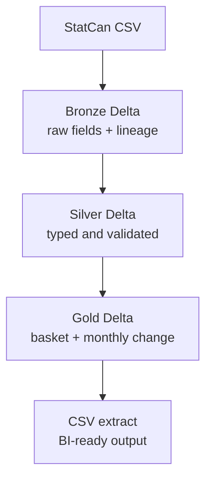

# Grocery Intelligence Index


The Grocery Intelligence Index is a Databricks data pipeline that transforms monthly Canadian
grocery-price records into a tested, analytics-ready Delta dataset. It preserves the source
product and unit grain while adding basket categories and valid month-over-month comparisons.

## What it answers

- How did a source grocery product's average price change from the immediately preceding month?
- How do price records differ between Canada and Ontario?
- Which source products belong to ten practical grocery basket categories?

The project uses Statistics Canada table
[18-10-0245-01](https://www150.statcan.gc.ca/t1/tbl1/en/tv.action?pid=1810024501). The repository does
not redistribute the source dataset.

## Architecture



| Layer | Responsibility | Primary controls |
| --- | --- | --- |
| Bronze | Land the CSV without inferred types | Empty-input failure, ingestion metadata |
| Silver | Type, trim, and filter records | Required schema, positive prices, unique business keys |
| Gold | Categorize products and calculate price movement | Unit-aware grain, consecutive-month validation |

## Correctness decisions

- The ten labels are **categories**, not ten individual rows. Original product descriptions and
  units are retained to prevent unlike package sizes from being silently combined.
- `PreviousMonthPrice` is populated only when the immediately preceding calendar month exists.
- A missing previous month remains null; it is not reported as a false 0% change.
- The default geographic scope is Canada and Ontario. The project makes no Toronto-level claim.

See the complete [Gold data contract](docs/data-contract.md).

## Repository structure

```text
.
├── Bronze/ Silver/ Gold/    # Thin Databricks notebook entrypoints
├── src/grocery_index/       # Testable Bronze, Silver, Gold, and quality logic
├── jobs/                    # Databricks Python task entrypoints
├── tests/                   # Local Spark unit and data-quality tests
├── resources/               # Databricks Workflow definition
├── docs/                    # Data contracts and engineering decisions
├── databricks.yml           # Databricks Asset Bundle targets
└── pyproject.toml           # Package and development dependencies
```

## Gold data model

| Column | Meaning |
| --- | --- |
| `SnapshotDate` | First day of the source reference month |
| `Geography` | Canada or Ontario by default |
| `BasketCategory` | One of ten configured grocery categories |
| `ProductName` | Original trimmed source product description |
| `UOM` | Source unit of measure |
| `AveragePrice` | Current source price |
| `PreviousMonthPrice` | Previous calendar month's price when available |
| `MoM_PercentageChange` | Percentage change from the valid previous month |

## Local validation

Python 3.10+ and Java are required for local PySpark tests.

```bash
python -m venv .venv
source .venv/bin/activate
pip install -e ".[dev]"
ruff check src tests jobs
pytest
```

GitHub Actions runs linting and tests for pull requests and changes to `main`.

## Databricks deployment

The default configuration preserves the existing catalog, schema, and volume paths. Review
`src/grocery_index/config.py` before deploying to another workspace.

```bash
databricks bundle validate -t dev
databricks bundle deploy -t dev
databricks bundle run grocery_intelligence_pipeline -t dev
```

The Workflow runs Bronze, Silver, and Gold sequentially with two task retries. A production target
is defined, but workspace authentication, cluster policy, permissions, schedules, notifications,
and production paths must be supplied by the deploying organization rather than embedded in this
public repository.

## Current scope and limitations

- Batch ingestion of one source CSV; incremental ingestion is not claimed.
- Full-table overwrite is retained from the original small portfolio workflow.
- Category matching uses the ten existing basket keywords and retains source-level grain.
- The CSV export uses one partition for convenient BI consumption and is intended for this compact
  dataset, not large-scale serving.
- No dashboard or performance benchmark is claimed until an artifact is published and reproducible.

## Tech stack

Databricks, PySpark, Delta Lake, Unity Catalog, Databricks Asset Bundles, pytest, Ruff, and GitHub
Actions.

## License

MIT

