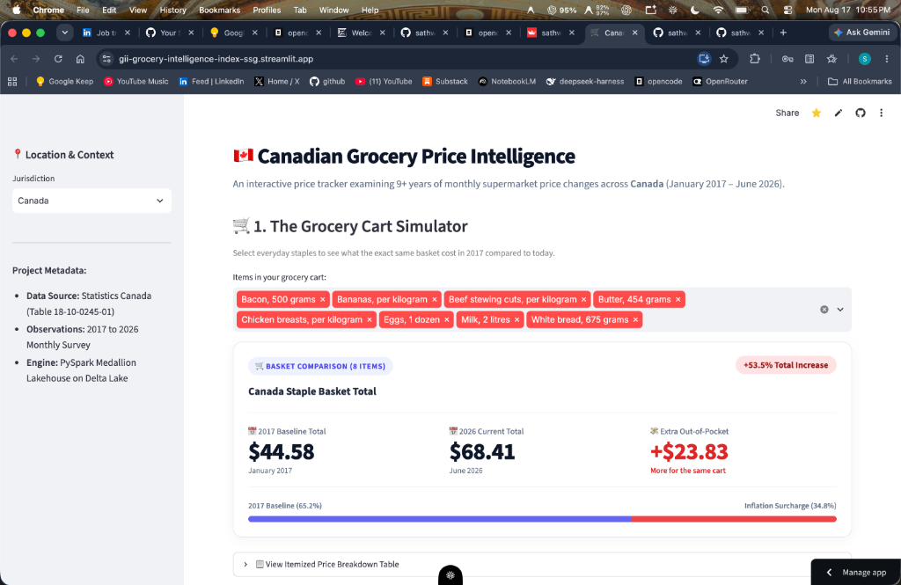
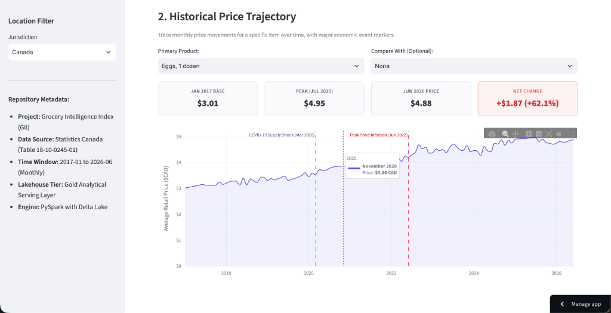
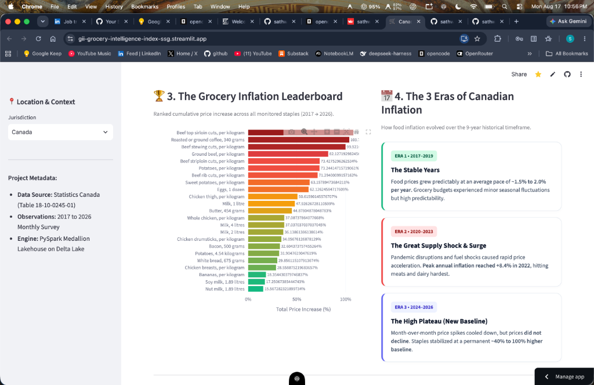
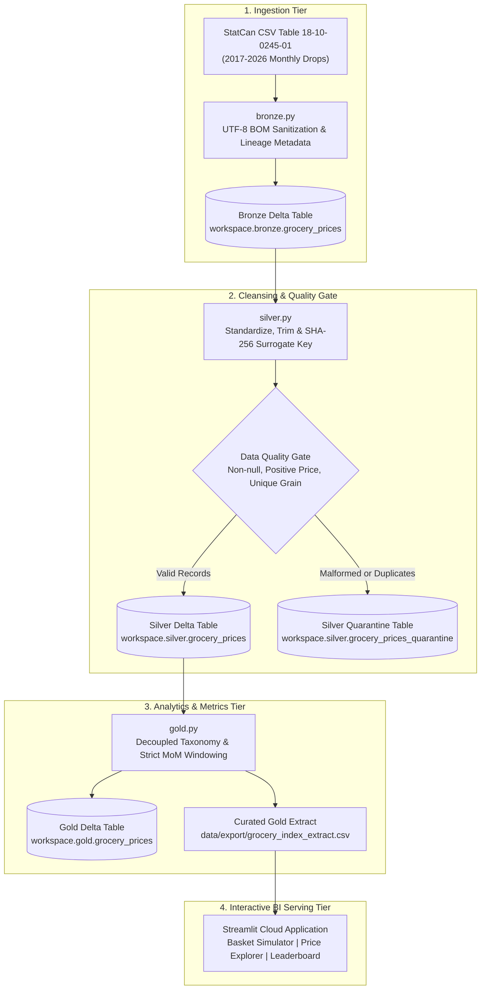

# Grocery Intelligence Index (GII)

[](https://gii-grocery-intelligence-index-ssg.streamlit.app/)
[](https://databricks.com)
[](https://spark.apache.org/)
[](https://delta.io/)
[](https://python.org)
[](https://github.com/sathwikio/GII-Grocery-Intelligence-Index/actions)


A PySpark and Delta Lake pipeline that ingests monthly Canadian grocery price surveys from **Statistics Canada (Table 18-10-0245-01)**, standardizes product and unit grains, enforces schema and data quality gates with dead-letter quarantine routing, and generates calendar-aligned Month-over-Month (MoM) price movement metrics across 10 staple grocery basket categories from 2017 to 2026.

---

## Interactive Dashboard (Serving Tier)

The pipeline exposes a clean, lightweight serving tier powered by Streamlit and Plotly to enable interactive price discovery, shopping cart inflation simulation, and macroeconomic timeline analysis:

| Module 1: Basket Simulation | Module 2: Price Trajectory |
| :--- | :--- |
|  |  |

| Module 3 & 4: Inflation Leaderboard & Historical Eras |
| :--- |
|  |

---

## Dataset Profile & Historical Findings (2017–2026)

This pipeline processes **138,816 historical survey records** published by Statistics Canada across 114 consecutive monthly survey drops (January 2017 – June 2026).

### Key Historical Inflation Benchmarks (Canada Aggregate)

| Staple Item | Package / Unit | Jan 2017 Price | Jun 2026 Price | Cumulative Change |
| :--- | :--- | :---: | :---: | :---: |
| **Beef stewing cuts** | Per kilogram | $12.66 | $25.31 | **+99.9%** |
| **Eggs** | 1 dozen | $3.01 | $4.88 | **+62.1%** |
| **Milk** | 1 litre | $2.17 | $3.21 | **+47.9%** |
| **Butter** | 454 grams | $4.10 | $5.94 | **+44.9%** |
| **Bacon** | 500 grams | $5.03 | $6.67 | **+32.6%** |
| **Chicken breasts** | Per kilogram | $11.38 | $14.63 | **+28.6%** |
| **Bananas** | Per kilogram | $1.58 | $1.87 | **+18.4%** |

### Domain & Data Quirks Handled
* **UTF-8 Byte Order Marks (BOM):** StatCan raw CSV exports contain a leading `\ufeff` byte sequence in the header row (`\ufeff"REF_DATE"`), handled automatically during Bronze ingestion.
* **Unit of Measure (UOM) Granularity:** Package sizes vary over time (e.g., `Milk, 1 litre`, `Milk, 2 litres`, `Milk, 4 litres`). The pipeline preserves the `(ProductName, UOM)` compound grain to prevent combining distinct container sizes.
* **Non-Contiguous Time Series:** Price surveys occasionally skip a month for specific rural regions. The pipeline uses strict `months_between(date, prev_date) == 1` calendar logic, assigning `null` rather than a false 0.0% change.

---

## Architecture & Data Flow


```mermaid
flowchart TD
    subgraph Landing["1. Ingestion Tier"]
        SourceCSV["StatCan CSV Table 18-10-0245-01<br/>(2017-2026 Monthly Drops)"]
        BronzeJob["bronze.py<br/>UTF-8 BOM Sanitization & Lineage Metadata"]
        BronzeDelta[("Bronze Delta Table<br/>workspace.bronze.grocery_prices")]
        SourceCSV --> BronzeJob
        BronzeJob --> BronzeDelta
    end

    subgraph SilverTier["2. Cleansing & Quality Gate"]
        SilverJob["silver.py<br/>Standardize, Trim & SHA-256 Surrogate Key"]
        DQEngine{"Data Quality Gate<br/>Non-null, Positive Price, Unique Grain"}
        SilverDelta[("Silver Delta Table<br/>workspace.silver.grocery_prices")]
        QuarantineDelta[("Silver Quarantine Table<br/>workspace.silver.grocery_prices_quarantine")]
        SilverJob --> DQEngine
        DQEngine -->|Valid Records| SilverDelta
        DQEngine -->|Malformed or Duplicates| QuarantineDelta
    end

    subgraph GoldTier["3. Analytics & Metrics Tier"]
        GoldJob["gold.py<br/>Decoupled Taxonomy & Strict MoM Windowing"]
        GoldDelta[("Gold Delta Table<br/>workspace.gold.grocery_prices")]
        GoldExtract["Curated Gold Extract<br/>data/export/grocery_index_extract.csv"]
        GoldJob --> GoldDelta
        GoldJob --> GoldExtract
    end

    subgraph ServingTier["4. Interactive BI Serving Tier"]
        StreamlitApp["Streamlit Cloud Application<br/>Basket Simulator | Price Explorer | Leaderboard"]
    end

    BronzeDelta --> SilverJob
    SilverDelta --> GoldJob
    GoldExtract --> StreamlitApp
```

---

## Key Technical Decisions

* **Dead-Letter Quarantine Pattern:** Instead of halting execution on dirty records, malformed or duplicate rows are routed to `workspace.silver.grocery_prices_quarantine` with descriptive rejection reasons (`NULL_SNAPSHOT_DATE`, `NON_POSITIVE_PRICE`, `DUPLICATE_BUSINESS_KEY`).
* **Deterministic Surrogate Keys:** Both Silver and Gold tiers generate SHA-256 surrogate keys (`RecordId` & `GoldRecordId`) across business grain dimensions for idempotent merges and downstream dimensional joins.
* **Decoupled Regex Taxonomy:** Category classification uses prioritized regex patterns with word boundaries (`\b`) in `taxonomy.py` to eliminate false substring matches (e.g., preventing *"Butter tarts"* from classifying as *"Butter"*).
* **Decoupled Architecture:** 100% of transformation logic is packaged in `src/grocery_index/`. Databricks workflows and notebooks serve purely as orchestration entry points.

Detailed documentation:
* [Architecture Decision Records (ADRs)](docs/architecture-decisions.md)
* [Data Contract & Schema Specs](docs/data-contract.md)
* [Operational Runbook & Backfill Guide](docs/runbook.md)

---

## Local Quickstart

The repository includes a single-command CLI runner to execute the full pipeline locally without cloud dependencies:

```bash
# 1. Clone repository
git clone https://github.com/sathwikio/GII-Grocery-Intelligence-Index.git
cd GII-Grocery-Intelligence-Index

# 2. Set up virtual environment
python3 -m venv .venv
source .venv/bin/activate
pip install -e ".[dev]"

# 3. Run the full Medallion pipeline locally
python -m grocery_index.cli run --env local
```

```text
======================================================================
Grocery Intelligence Index Pipeline | Environment: [LOCAL]
======================================================================
• Source Path:       /.../data/raw/18100245.csv
• Bronze Table/Path: /.../data/delta/bronze_grocery_prices
• Silver Table/Path: /.../data/delta/silver_grocery_prices
• Gold Table/Path:   /.../data/delta/gold_grocery_prices
• Target Geographies: canada, ontario
======================================================================

[1/3] Ingesting raw dataset into Bronze (138,816 survey records)...
  ✓ Bronze stage completed.

[2/3] Validating, cleansing, and promoting to Silver...
  ✓ Silver stage completed.

[3/3] Categorizing baskets and computing MoM metrics in Gold...
  ✓ Gold stage completed.

======================================================================
Pipeline execution completed successfully.
======================================================================
```

---

## Development & Testing

```bash
# Code style and formatting checks
make lint
make format

# Run PySpark unit, quality, and end-to-end integration tests
make test-cov
```

GitHub Actions automatically runs the test suite across **Python 3.10, 3.11, and 3.12** along with Databricks Asset Bundle validation.

---

## Gold Data Model

The Gold tier models monthly price movements for ten standard Canadian consumer basket categories across 2017–2026:

| Column | Data Type | Nullable | Description |
| :--- | :--- | :---: | :--- |
| `GoldRecordId` | `string` | No | SHA-256 surrogate hash key of analytical grain |
| `SnapshotDate` | `date` | No | First day of reference survey month (`yyyy-MM-01`) |
| `Geography` | `string` | No | Jurisdictional boundary (`Canada` or `Ontario`) |
| `BasketCategory` | `string` | No | Standardized basket category (Milk, Eggs, Bread, Butter, Chicken, etc.) |
| `ProductName` | `string` | No | Trimmed source product description |
| `UOM` | `string` | No | Unit of measure (e.g. `Dollars`, `Cents`) |
| `AveragePrice` | `double` | No | Current reference month price |
| `PreviousMonthPrice` | `double` | Yes | Price from the immediately preceding calendar month |
| `MoM_AbsoluteChange` | `double` | Yes | `AveragePrice - PreviousMonthPrice` |
| `MoM_PercentageChange` | `double` | Yes | Percentage change from previous consecutive month |

---

## Databricks Deployment (DAB)

This repository uses **Databricks Asset Bundles (DAB)** for workflow deployment:

```bash
# Validate bundle configuration
databricks bundle validate -t dev

# Deploy workflow to workspace
databricks bundle deploy -t dev

# Trigger pipeline run
databricks bundle run grocery_intelligence_pipeline -t dev
```

---

## Repository Structure

```text
.
├── streamlit_app.py         # Streamlit BI serving application
├── requirements.txt         # Lightweight serving tier dependencies
├── src/grocery_index/       # Core PySpark transformations & data quality engine
│   ├── bronze.py            # Raw ingestion, BOM sanitization & audit lineage
│   ├── silver.py            # Cleansing, surrogate key generation & quarantine routing
│   ├── gold.py              # Basket categorization & strict MoM windowing
│   ├── taxonomy.py          # Decoupled regex taxonomy rules & boundary protection
│   ├── quality.py           # Data quality rules & dead-letter logic
│   ├── config.py            # Multi-environment configuration (local/dev/prod)
│   ├── logging.py           # Structured pipeline logging & execution metrics
│   └── cli.py               # Local & CLI pipeline execution runner
├── jobs/                    # Databricks Python workflow entrypoints
├── notebooks/               # Interactive exploration & Databricks notebooks
├── data/
│   ├── raw/                 # Official StatCan 18-10-0245-01 dataset (2017–2026)
│   ├── export/              # Curated Gold analytical extract for serving
│   └── sample/              # Bundled sample dataset for unit testing
├── tests/                   # PySpark unit, quality, and end-to-end integration tests
├── resources/               # Databricks Asset Bundle workflow YAML definition
├── docs/
│   ├── images/                    # UI dashboard visual assets
│   ├── architecture-decisions.md  # Architecture Decision Records (ADRs)
│   ├── data-contract.md           # Schema contracts and SLA definitions
│   └── runbook.md                 # Operational runbook & backfill procedures
├── databricks.yml           # Databricks Asset Bundle configuration
├── Makefile                 # Developer targets for setup, lint, test, and run
└── pyproject.toml           # Package dependencies and tooling configuration
```

---

## License

Distributed under the MIT License. See `LICENSE` for details.
